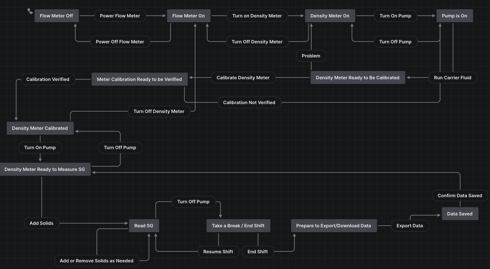

# DensityMeterHelper
A tool that uses a state machine that helps people properly use density meters.

---

#### Tools Used

[Stately.ai](https://stately.ai) was used to create the logic behind the 
state machine.

[Vue 2](https://v2.vuejs.org/v2/guide/) was used for the frontend.

#### Real Life Use Cases

There can be a backend added to this project, with some logic changes 
depending on use case, to help integrate this frontend to a PLC system.

This way, it can prevent improper use of industrial equipment.

#### Logic

Here is the logic from Stately:

